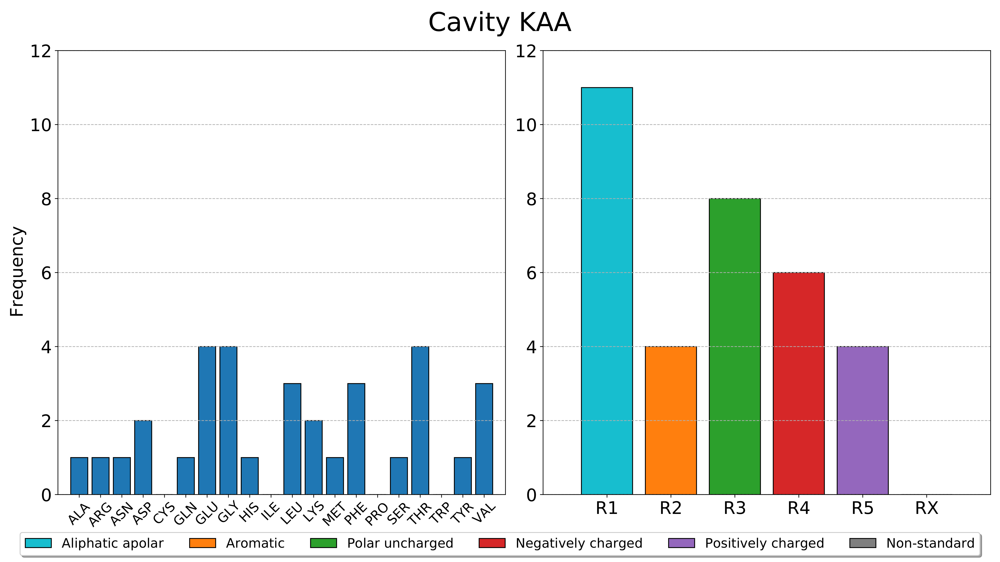

pyKVFinder.plot_frequencies
===========================

Plot histograms of calculated frequencies (residues and classes of residues) for each detected cavity in a target PDF file.

.. code-block:: python

    pyKVFinder.plot_frequencies(frequencies, fn = 'histograms.pdf)

:Args:

    ``frequencies`` : *dict*
        A dictionary with frequencies of interface residues and classes of residues of each detected cavity
    ``fn`` : *str, default 'histograms.pdf'*
        A path to PDF file for plotting histograms of frequencies.

:Returns:
    
    A PDF file with histograms of calculated frequencies (residues and classes of residues) of each detected cavity.

.. note::

  The cavity nomenclature is based on the integer label. The cavity marked with 2, the first integer corresponding to a cavity, is KAA, the cavity marked with 3 is KAB, the cavity marked with 4 is KAC and so on. 

  The classes of residues are:

    * ``R1`` : Alipathic apolar
        Alanine, Glycine, Isoleucine, Leucine, Methionine, Valine
    * ``R2`` : Aromatic
        Phenylalanine, Tryptophan, Tyrosine
    * ``R3`` : Polar Uncharged
        Asparagine, Cysteine, Glutamine, Proline, Serine, Threonine
    * ``R4`` : Negatively charged
        Aspartate, Glutamate
    * ``R5`` : Positively charged
        Arginine, Histidine, Lysine
    * ``RX`` : Non-standard
        Non-standard residues

.. seealso::
  
  * `pyKVFinder.calculate_frequencies <calculate_frequencies.html>`_

.. raw:: html

    <h4><u>Example</u></h4>

With the residues and classes of residues frequencies calculated with ``pyKVFinder.calculate_frequencies``, we can plot the histograms of these frequencies in a PDF file.

.. code-block:: python

    >>> from pyKVFinder import plot_frequencies
    >>> frequencies
    {'KAA': {'RESIDUES': {'ALA': 1, 'ARG': 1, 'ASN': 1, 'ASP': 2, 'GLN': 1, 'GLU': 4, 'GLY': 4, 'HIS': 1, 'LEU': 3, 'LYS': 2, 'MET': 1, 'PHE': 3, 'SER': 1, 'THR': 4, 'TYR': 1, 'VAL': 3}, 'CLASS': {'R1': 11, 'R2': 4, 'R3': 8, 'R4': 6, 'R5': 4, 'RX': 0}}}
    >>> plot_frequencies(frequencies, fn='histograms.pdf')

