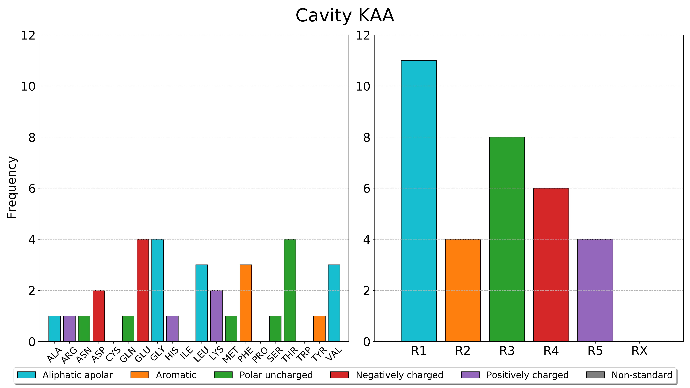

pyKVFinder.plot_frequencies
===========================

.. autofunction:: pyKVFinder.plot_frequencies

.. seealso::
  
  * `pyKVFinder.calculate_frequencies <calculate_frequencies.html>`_

.. raw:: html

    <h4><u>Example</u></h4>

With the residues and classes of residues frequencies calculated with ``pyKVFinder.calculate_frequencies``, we can plot the bar charts of these frequencies in a PDF file.

.. code-block:: python

    >>> from pyKVFinder import plot_frequencies
    >>> frequencies
    {'KAA': {'RESIDUES': {'ALA': 1, 'ARG': 1, 'ASN': 1, 'ASP': 2, 'GLN': 1, 'GLU': 4, 'GLY': 4, 'HIS': 1, 'LEU': 3, 'LYS': 2, 'MET': 1, 'PHE': 3, 'SER': 1, 'THR': 4, 'TYR': 1, 'VAL': 3}, 'CLASS': {'R1': 11, 'R2': 4, 'R3': 8, 'R4': 6, 'R5': 4, 'RX': 0}}}
    >>> plot_frequencies(frequencies, fn='barplots.pdf')

