Biomolecular cavity detection
=============================

In this tutorial, we will use pyKVFinder on a catalytic subunit of a cAMP-dependent protein kinase (cADK) to identify and characterize its cavities. All files used in this tutorial can be found our `GitHub repository <https://github.com/LBC-LNBio/pyKVFinder>`_:

* `1FMO.pdb <https://github.com/LBC-LNBio/pyKVFinder/blob/master/pyKVFinder/data/tests/1FMO.pdb>`_
* `ADN.pdb <https://github.com/LBC-LNBio/pyKVFinder/blob/master/pyKVFinder/data/tests/ADN.pdb>`_

First, load the `1FMO.pdb` and `ADN.pdb` file into PyMOL:

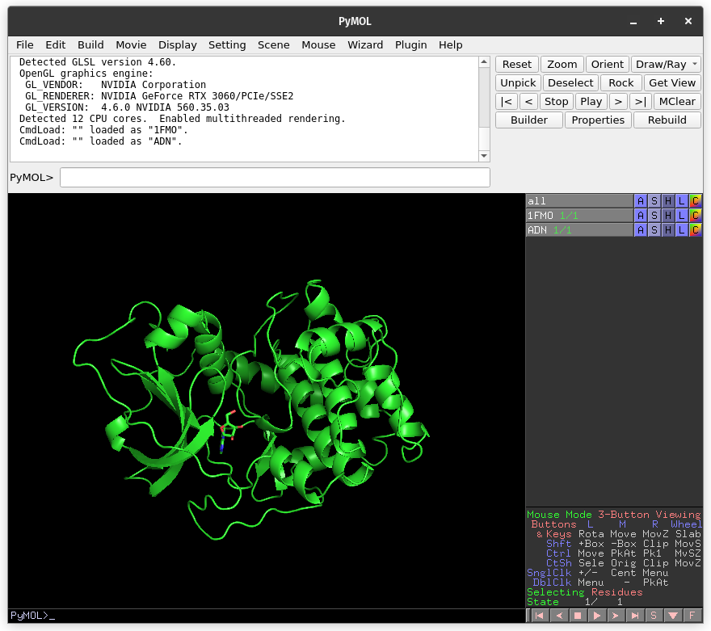

Whole biomolecule detection
---------------------------

The default parameters are designed to make a simple and fast whole biomolecule detection. 

On PyMOL, open PyMOL pyKVFinder Tools under Plugin tab. The objects on the scene will be listed on the **Input PDB** combo box, on the **Main** tab. If not, press the **Refresh** button.

The **Input PDB** selection sets which object will be analyzed by pyKVFinder. Select **1FMO** on the list box.

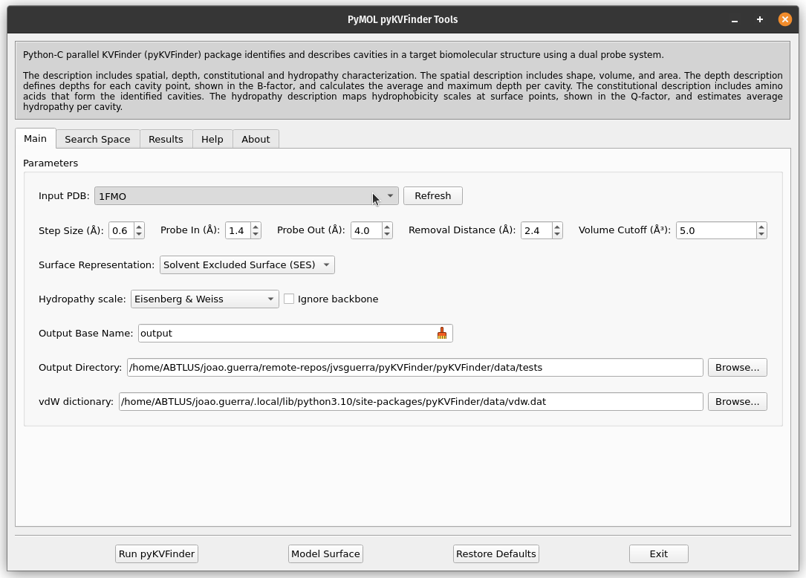

To run pyKVFinder with the default parameters, just click **Run pyKVFinder** button.

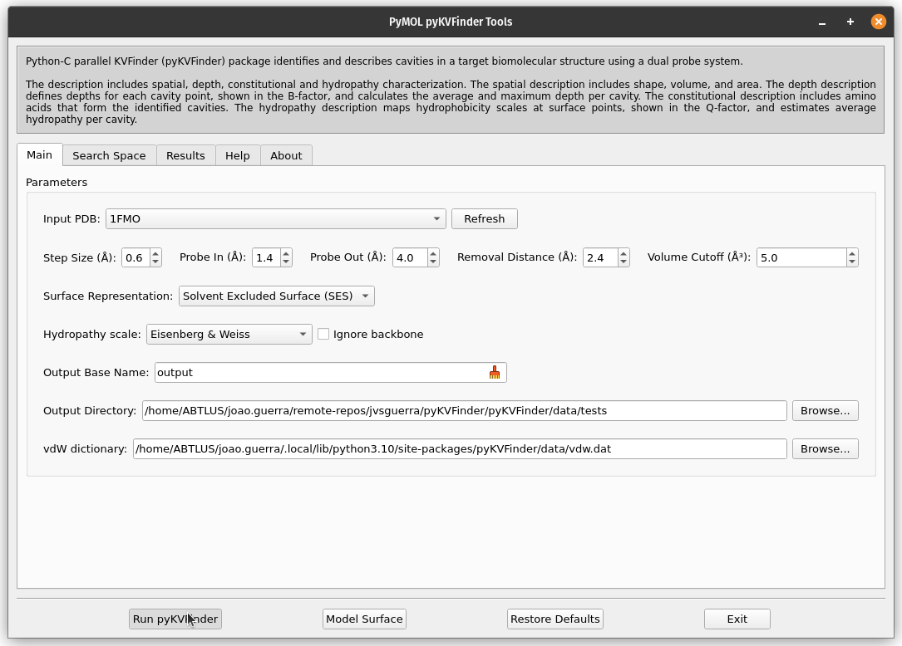

After execution is complete, cavities PDB is loaded into PyMOL viewer as \<Output Base Name\>.KVFinder.output object and the results file is loaded on the **Results** tab. In addition, the focus automatically shifts to **Results** tab.

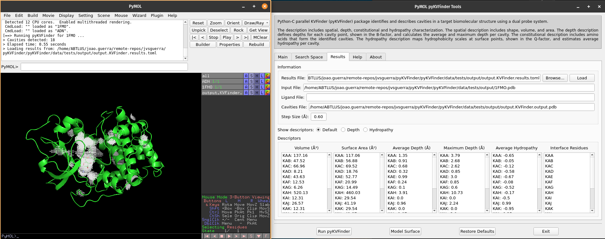

We can select cavities in the **Volume** or **Surface Area** lists to highlight them on a new object called **cavities**, identifying each cavity. Additionally, we can select cavity tags in the **Interface Residues** list to highlight residues around the cavities on a new object named **residues**.

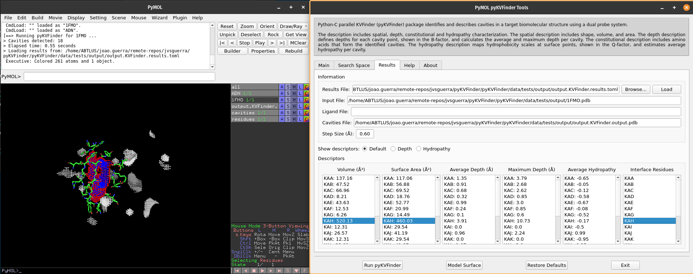

.. note::
    
    The interface residues surrounding the cavity KAH are colored in green (sticks), the surface points are colored in red (nb_spheres) and the remaining cavity points are colored in blue (non_bounded).

We can visualize depth of the cavity points by clicking on **Depth** option on **Show descriptors**. We can select cavities in the **Average Depth** or **Maximum Depth** lists to highlight them on a new object called **depths**, identifying each cavity. 

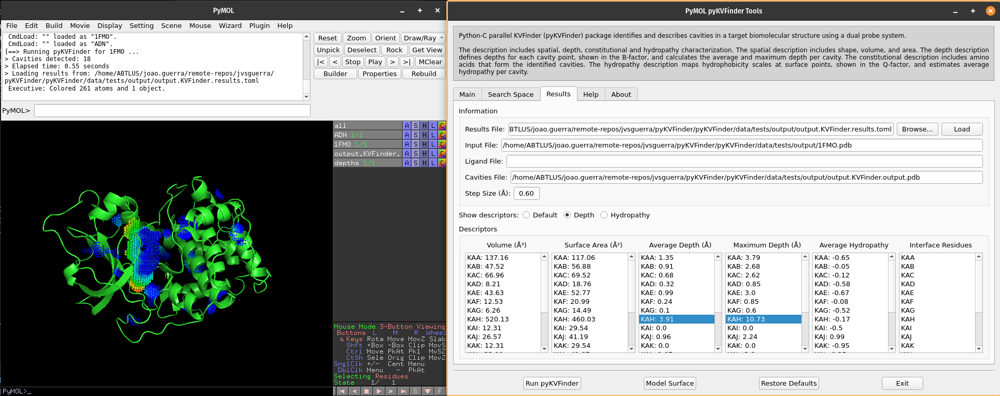

.. note::
    
    The cavity points are colored using a gradient from blue to red to represent the depth of each point. The blue points correspond to the shallowest points on the cavity-bulk boundary, while the red points correspond to the deepest points. The depth scale ranges from 0.0 to the maximum depth of all cavities

We can visualize hydropathy of the surface points by clicking on **Hydropathy** options on **Show descriptors**. We can select cavities in the **Average Hydropathy** list to highlight them on a new object called **hydropathy**, identifying each cavity. 

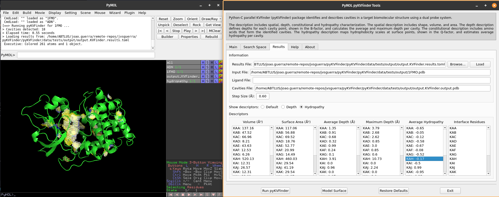

.. note::

    The surface points are colored based on the closest amino acid to it. The Eisenberg & Weiss hydrophobicity scale ranges from -1.42 (highly hydrophobic) to 2.6 (highly hydrophilic).

Changing cavity boundary
^^^^^^^^^^^^^^^^^^^^^^^^

pyKVFinder is all about parameter customization. One of pyKVFinder's most powerful assets is the ability to manually set the cavity boundary.

pyKVFinder works with a double probe system to detect cavities. A smaller probe, called Probe In, and a bigger one, called Probe Out, that defines two molecular surfaces with different molecular accessibility. The space left between these surfaces is considered cavities.

Let's show the effect of varying **Probe Out** and **Removal Distance** on the cavity boundary.

First, we should copy the cavity KAH to a new object to compare cavity boundary from the previous execution.

.. code-block:: bash

    # Copy KAH
    select resn KAH and output.KVFinder.output
    create KAH, sele
    delete sele
    # Color KAH
    color magenta, KAH

Adjusting Probe Out
"""""""""""""""""""

As mentioned above, adjusting the Probe Out size changes the level of the cavity boundary. So let's go back on the **Main** tab and change the **Probe Out** size to 8.0 Å. Run pyKVFinder again.

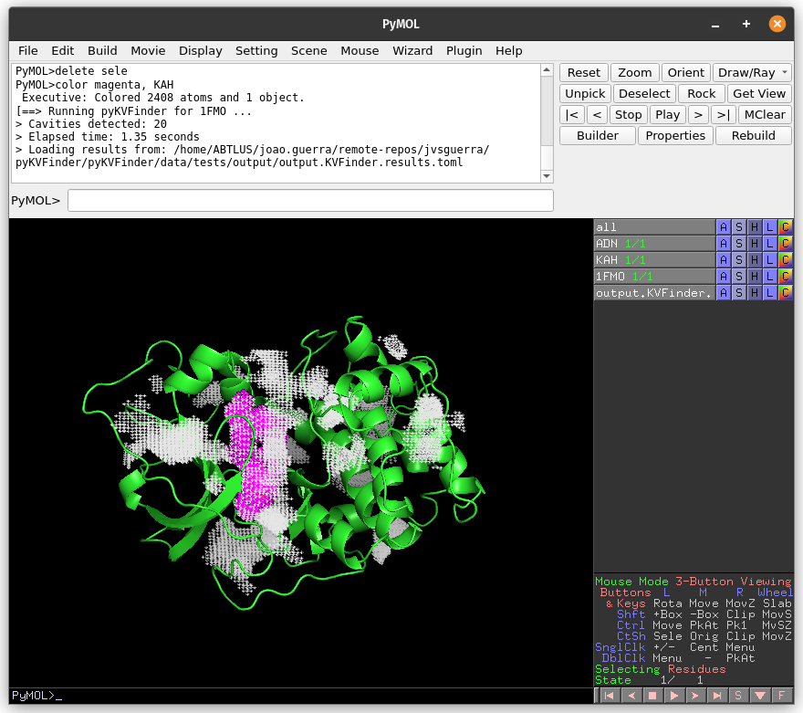

Again, copy the cavity KAF (same region of the previous detection) to a new object (KAF_PO).

.. code-block:: bash

    # Copy KAF
    select resn KAF and output.KVFinder.output
    create KAF_PO, sele
    delete sele

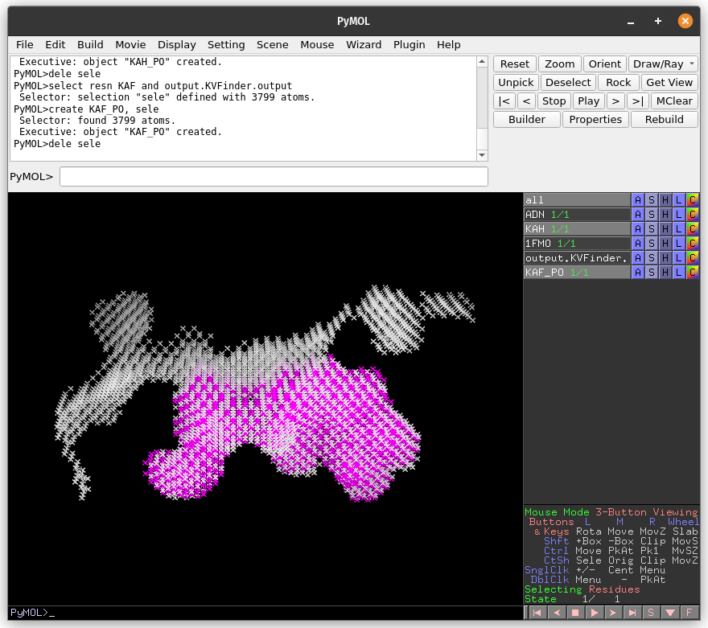

The cavity detected with the 4 Å Probe Out (magenta) has a lower boundary than that detected with the 8 Å probe (white). Therefore, by increasing the size of the Probe Out, the cavity boundary is also raised.

Adjusting Removal Distance
""""""""""""""""""""""""""

Besides adjusting the Probe Out size, we can also adjust the Removal Distance to change the cavity boundary. So let's go back to the **Main** tab and change the **Removal Distance** to 1.2 Å and the size of Probe Out back to 4.0 Å. Run pyKVFinder again.

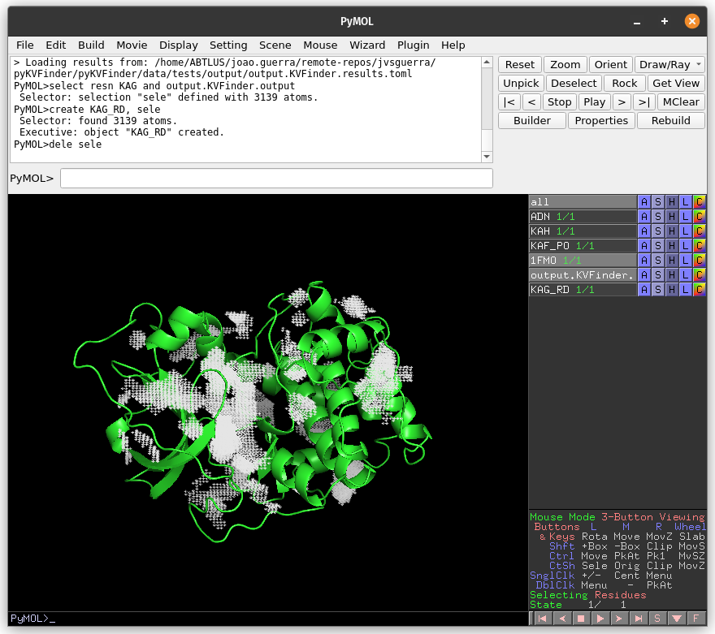

Again, copy the cavity KAG (same region of the previous detections) to a new object (KAG_RD).

.. code-block:: bash

    # Copy KAG
    select resn KAG and output.KVFinder.output
    create KAG_RD, sele
    delete sele

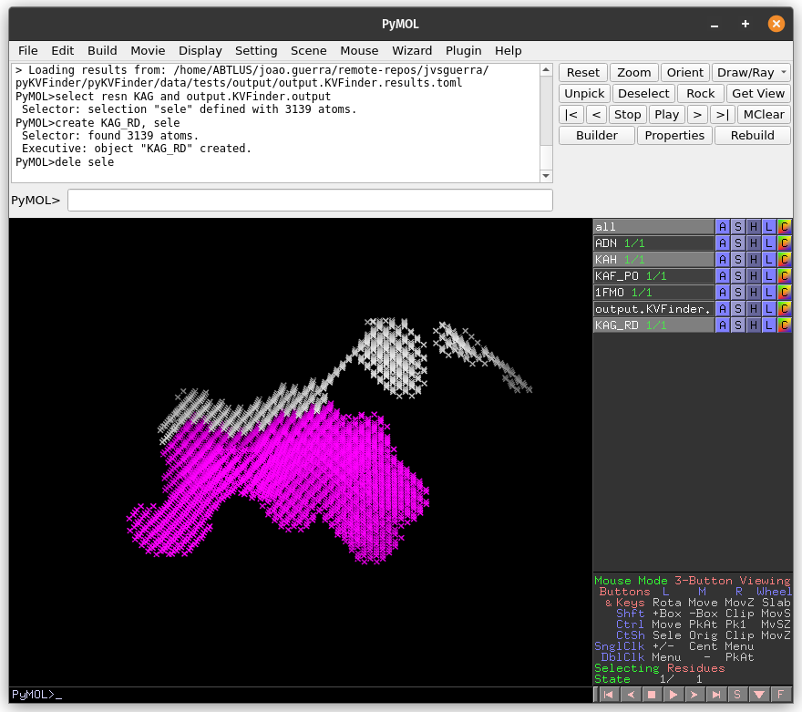

|
  
The cavity KAH detected with the 2.4 Å Removal Distance (magenta) has a lower boundary than that detected with the 1.2 Å (KAG; white). Therefore, by decreasing the Removal Distance, the cavity boundary is also raised.

Furthermore, changing the cavity boundary by varying Probe Out and Removal Distance also affects cavity segregation.

.. note::

    Usually the Removal Distance adjustment is less time-consuming than the Probe Out adjustment for similar effects.

Steered detection
-----------------

An important feature of parKVFinder is the steered detection of cavities. We continue our tutorial illustrating two distinct methods of cavity segmentation.

Box adjustment mode 
^^^^^^^^^^^^^^^^^^^

Box adjustment mode explores closed regions with a custom box, which can be drawn via the GUI.

On the **Search Space** tab, select **Box Adjustment** check box. This will enable a **Box Adjustment** frame, which handles the custom box in PyMOL viewer

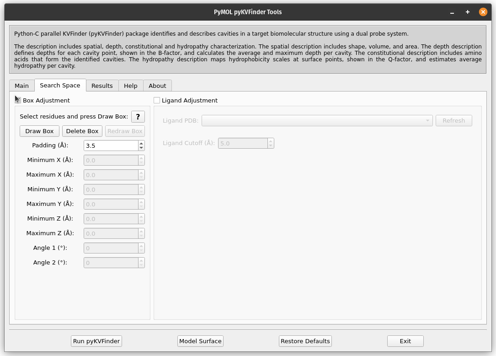

Then, select the adenosine ligand on ADN object. This can be made on the PyMOL viewer by clicking on the ligand structure or using ``select resn ADN`` PyMOL command.

Click on **Draw Box** Button. This will create a custom box that limits the search space. It is fully customizable, but we will not change it for now.

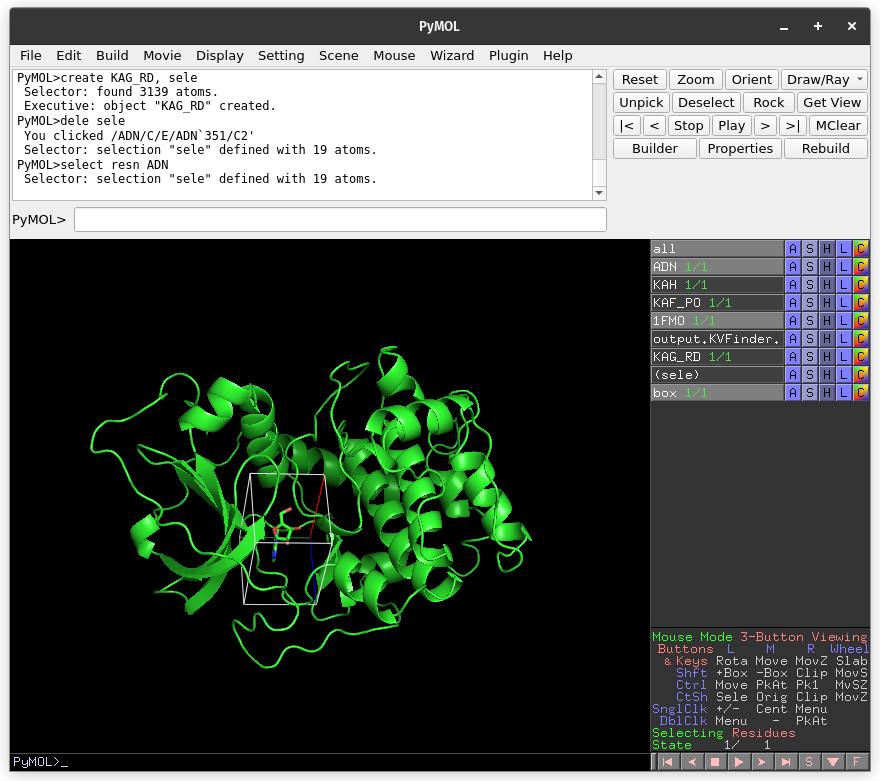

On the **Main** tab, change **Removal Distance** back to 2.4 Å. Run pyKVFinder again.

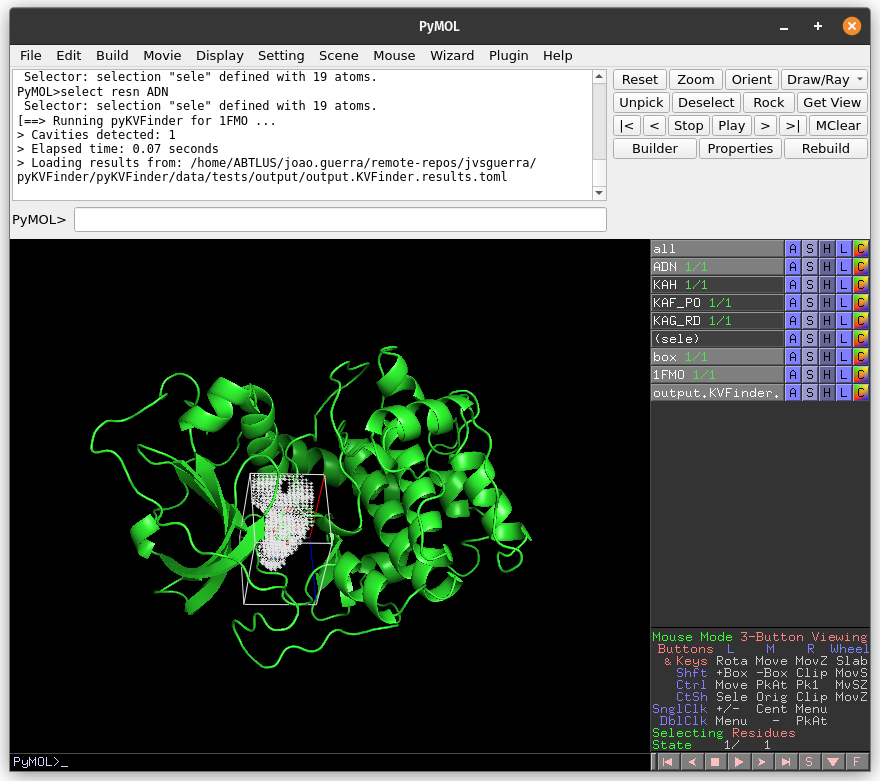

Now, let's customize the box parameters to segment the binding site of our target protein.

Each axis is associated with one color (red with X, green with Y and blue with Z). The adjustment is made by the arrows or directly setting the value in the entry on the **Search Space** tab in the **Box Adjustment** group. We can also adjust the box angles by the same procedure. After altering the values, just click on **Redraw** button to redraw the box object using the new values.

Then, on the **Search Space** tab, reduce **Maximum X** to 1.0 Å and click **Redraw Box**. Run pyKVFinder again.

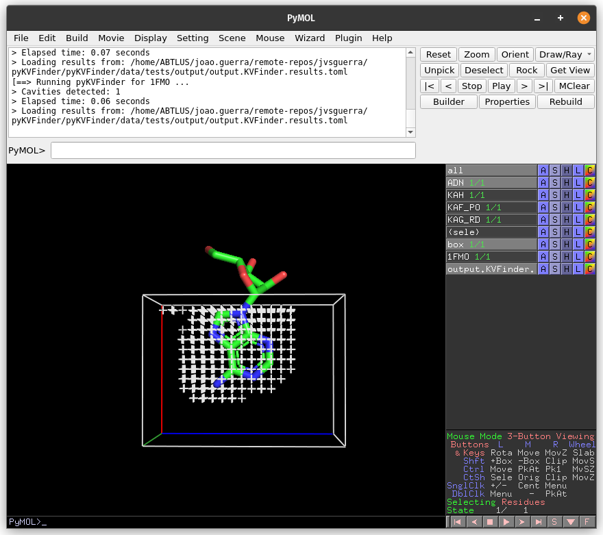

Lastly, click on **Delete Box** button to delete the custom box.

Ligand adjustment mode
^^^^^^^^^^^^^^^^^^^^^^

A last feature is to limit the search around a structure. In this last example, let's do a whole protein prospection again, but limiting the search space around ligands.

First, on the **Search Space** tab, deselect **Box Adjustment** check box, which will disable the previous enabled **Box Adjustment** frame.

Still on the **Search Space** tab, click on the check button **Ligand Adjustment**, which will enable the **Refresh** button, the **Ligand PDB** combo box and the **Ligand Cutoff** entry.

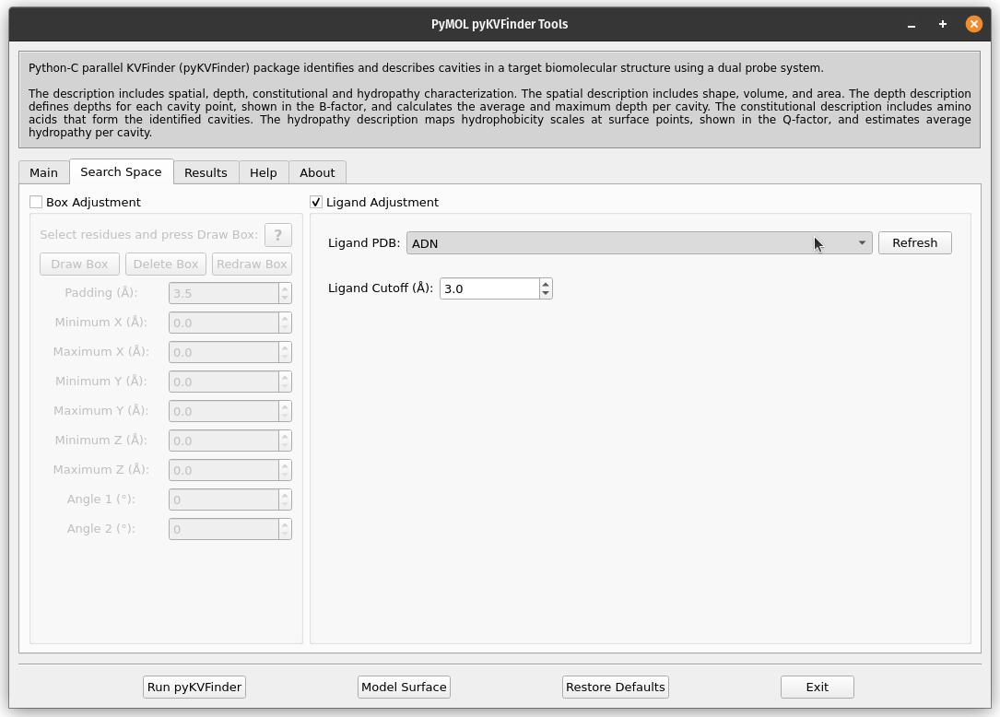

Click the **Refresh** button to display all objects in the scene in the Ligand PDB combo box. Select the **ADN** on the combo box and reduce Ligand Cutoff to 3.0 Å. Run pyKVFinder again.

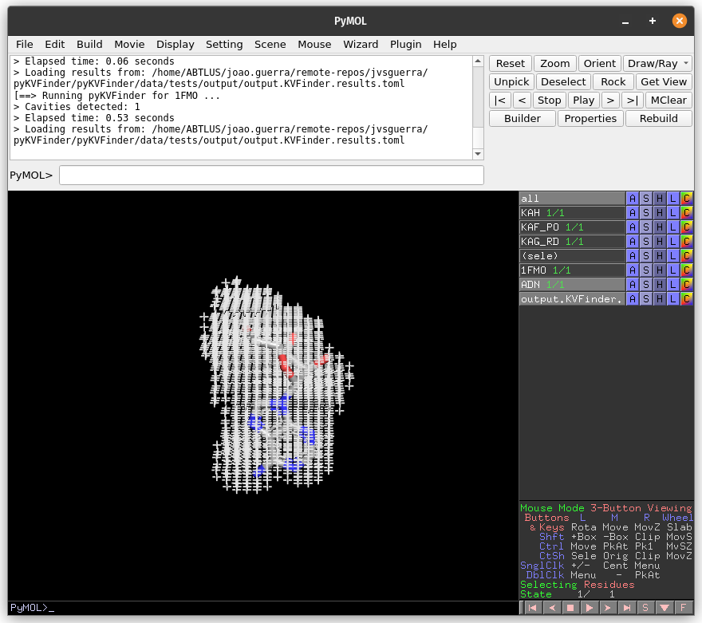

On the **Search Space** tab, increase **Ligand Cutoff** back to 5.0 Å. Back on the **Main** tab, increase **Probe Out** to 10.0 Å and reduce **Removal Distance** to 0.0 Å. Run pyKVFinder again.

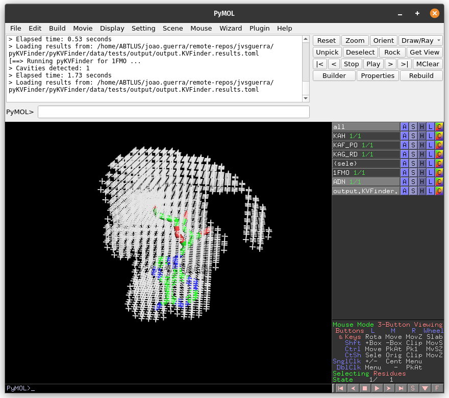
